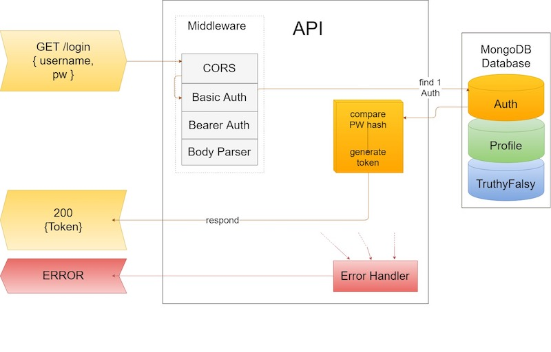
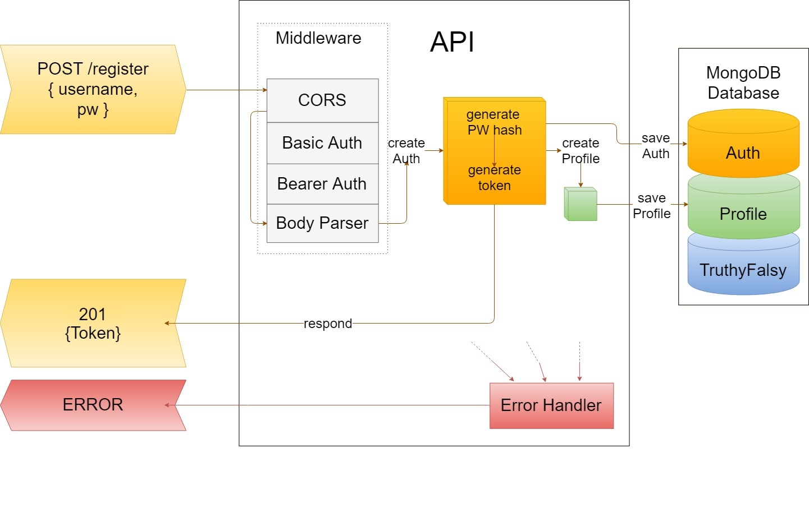
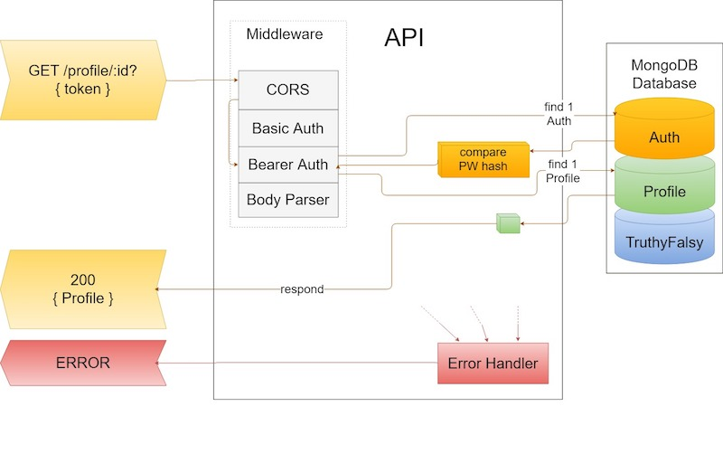
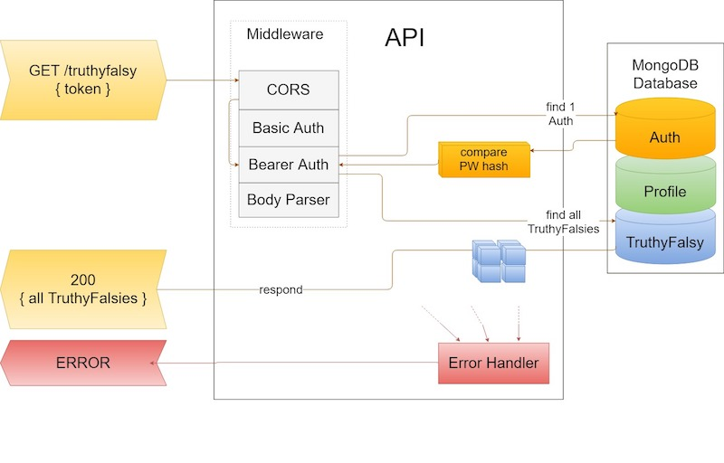
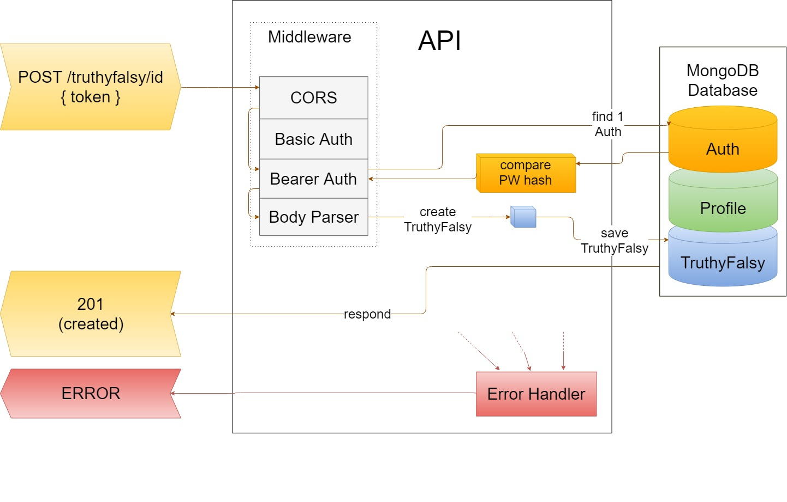

          ___          _     _ _     _
        / __| ___  __| |__ (_) |_  | |_ ___   _ __  ___
        \__ \/ _ \/ _| / / | |  _| |  _/ _ \ | '  \/ -_)
        |___/\___/\__|_\_\ |_|\__|  \__\___/ |_|_|_\___|

[](https://travis-ci.org/sockittome/back)

## General information
**_Authors_**:
* Jeremy Pearson: https://github.com/jpjazzy
* Melanie Downing: https://github.com/sayanything830
* Joy Hou: https://github.com/strawbee
* Ender Smith: https://github.com/EnderSmith
* Dean Murphy: https://github.com/dmurphy90

**_Version_**: 1.0.0 [Back end]

**_Libraries_**:

    "babel-eslint": "^8.2.2",
    "babel-jest": "^22.4.1",
    "eslint": "^4.18.2",
    "eslint-plugin-babel": "^4.1.2",
    "eslint-plugin-import": "^2.8.0",
    "jest": "^22.4.2",
    "request": "^2.83.0",
    "superagent": "^3.8.2"
    "babel": "^6.23.0",
    "babel-cli": "^6.26.0",
    "babel-core": "^6.26.0",
    "babel-loader": "^7.1.3",
    "babel-plugin-transform-object-rest-spread": "^6.26.0",
    "babel-preset-env": "^1.6.1",
    "babel-register": "^6.26.0",
    "bcrypt": "^1.0.3",
    "body-parser": "^1.18.2",
    "cookie-parser": "^1.4.3",
    "cors": "^2.8.4",
    "dotenv": "^5.0.1",
    "express": "^4.16.2",
    "faker": "^4.1.0",
    "http-errors": "^1.6.2",
    "json-parser": "^1.1.5",
    "jsonwebtoken": "^8.2.0",
    "mongoose": "^5.0.9",
    "morgan": "^1.9.0",
    "multer": "^1.3.0",
    "nodemon": "^1.17.1",
    "ramda": "^0.25.0",
    "randomstring": "^1.1.5",
    "socket.io": "^2.0.4",
    "webpack": "^4.1.0"

**_Last modified_**: 3/22/2018

## About the app

Sock it to me is a javascript based game website where you can games with local groups, and with an emphasis on educational games.

Currently as a first model, the only game implemented is called truthy falsy and is variation on a quiz game. The goal is simple. All answers are true or false and your goal is to get the most points. This game is meant for classes and large groups.

To join a room, all you need is the code. The games are meant to be played with a host screen and all other players are looking at the host screen. You can join from other places, but if you can't see the host screen, you won't be able to see some important information, so make sure you can! A host can see all quizzes made in the database. To have a wide selection of quizzes to choose from, invite your friends and have everyone make quizzes!

## How to use our project

1. One person go to sockit.live and sign up or sign in as a host. Select a game (currently only truthyfalsy) and create a quiz to use or select a quiz you have made and start a game.
2. Give your friends the generated 4 character room code.
3. Have your friends go to sockit.live and select "join as a player", then input the room code and your name.
4. When ready, the host can click start to start, and it's game on!

## How to set up your own Sock it to me game (back end)

### Pre-requisits

Install and have [MongoDB](https://docs.mongodb.com/manual/installation/) running.

### Cloning

Clone our repo with:
```
git clone https://github.com/sockittome/back.git
```

### Installing dependencies

Install the necessary dependencies with:
```
npm i
```

### Running

In terminal type the following to run start a server after installing dependencies:
```
npm run start
```

## Tests

To run test use:
```
npm run test
```

## Routes
### Auth
##### `POST /api/v1/register`
* `request`: receives `POST` with body containing `username` and `password` properties
* `response`: saves authenticated `user`, sends `201` (created) and a `token` (JWT)
* `error`:
  * invalid `username` or `password`: sends `400` (bad-request) error
  * `username` taken: sends `200` (okay) with a message explaining the conflict

##### `GET /api/v1/login`
* `request`: receives `GET` with body containing `username` and `password` properties
* `response`: sends `200` (okay) with body containing JWT `token`
* `error`:
  * invalid `password`: sends `400` (bad-request) error
  * `username` not found: sends `404` (not-found) error


### Profile
##### `GET api/v1/profile/{_id}?`
* `Description`: gets a profile based on an id or token.

##### `PUT api/v1/profile/{_id}?`
* `Description`: updates a profile based on an id or token.
##### `DELETE api/v1/profile/{_id}?`
* `Description`: deletes a profile based on an id or token.

### truthyfalsy
##### `GET api/v1/truthyfalsy/:_id?`
* `Description`: gets a truthyfalsy (quiz) based on an id or token.

##### `PUT api/v1/truthyfalsy/:_id?`
* `Description`: updates a truthyfalsy (quiz) based on an id or token.
##### `DELETE api/v1/truthyfalsy/:_id?`
* `Description`: deletes a truthyfalsy (quiz) based on an id or token.
##### `POST api/v1/truthyfalsy/:_id?`
* `Description`: deletes a truthyfalsy (quiz) based on an id or token.


### File tree structure

```
Back end Directory
├── ./data
│   └── ./data/db
│       ├── ./data/db/collection-0--7220743448173591703.wt
│       ├── ./data/db/collection-0-7222716909947995817.wt
│       ├── ./data/db/collection-2--7220743448173591703.wt
│       ├── ./data/db/collection-3-7222716909947995817.wt
│       ├── ./data/db/diagnostic.data
│       │   ├── ./data/db/diagnostic.data/metrics.2018-03-20T21-58-05Z-00000
│       │   ├── ./data/db/diagnostic.data/metrics.2018-03-20T22-10-24Z-00000
│       │   ├── ./data/db/diagnostic.data/metrics.2018-03-20T22-11-11Z-00000
│       │   └── ./data/db/diagnostic.data/metrics.2018-03-21T15-06-21Z-00000
│       ├── ./data/db/index-1--7220743448173591703.wt
│       ├── ./data/db/index-1-7222716909947995817.wt
│       ├── ./data/db/index-2-7222716909947995817.wt
│       ├── ./data/db/index-3--7220743448173591703.wt
│       ├── ./data/db/index-4-7222716909947995817.wt
│       ├── ./data/db/index-5-7222716909947995817.wt
│       ├── ./data/db/journal
│       │   ├── ./data/db/journal/WiredTigerLog.0000000004
│       │   ├── ./data/db/journal/WiredTigerPreplog.0000000001
│       │   └── ./data/db/journal/WiredTigerPreplog.0000000002
│       ├── ./data/db/_mdb_catalog.wt
│       ├── ./data/db/mongod.lock
│       ├── ./data/db/sizeStorer.wt
│       ├── ./data/db/storage.bson
│       ├── ./data/db/WiredTiger
│       ├── ./data/db/WiredTigerLAS.wt
│       ├── ./data/db/WiredTiger.lock
│       ├── ./data/db/WiredTiger.turtle
│       └── ./data/db/WiredTiger.wt
├── ./docs
│   ├── ./docs/GET-login.jpg
│   ├── ./docs/GET-profile-id.jpg
│   ├── ./docs/GET-truthyfalsy-id.jpg
│   ├── ./docs/GET-truthyfalsy.jpg
│   ├── ./docs/POST-register.jpg
│   └── ./docs/POST-truthyfalsy.jpg
├── ./index.js
├── ./package.json
├── ./package-lock.json
├── ./README.md
└── ./src
    ├── ./src/game
    │   └── ./src/game/truthyfalsy.js
    ├── ./src/lib
    │   ├── ./src/lib/db.js
    │   ├── ./src/lib/http-server.js
    │   ├── ./src/lib/io-server.js
    │   ├── ./src/lib/room.js
    │   └── ./src/lib/utils.js
    ├── ./src/__load_test__
    │   ├── ./src/__load_test__/complex-load-test.json
    │   ├── ./src/__load_test__/load-test-create-user.js
    │   ├── ./src/__load_test__/results
    │   │   ├── ./src/__load_test__/results/breaking-test.txt
    │   │   └── ./src/__load_test__/results/passing-test.txt
    │   └── ./src/__load_test__/simple-load-test.json
    ├── ./src/main.js
    ├── ./src/middleware
    │   ├── ./src/middleware/basic-auth.js
    │   ├── ./src/middleware/bearer-auth.js
    │   └── ./src/middleware/error-handler.js
    ├── ./src/model
    │   ├── ./src/model/auth.js
    │   ├── ./src/model/profile.js
    │   └── ./src/model/truthyfalsy.js
    ├── ./src/route
    │   ├── ./src/route/route-auth.js
    │   ├── ./src/route/route-profile.js
    │   └── ./src/route/route-truthyfalsy.js
    └── ./src/__test__
        ├── ./src/__test__/lib
        │   ├── ./src/__test__/lib/jest-setup.js
        │   └── ./src/__test__/lib/mocks.js
        ├── ./src/__test__/routes
        │   ├── ./src/__test__/routes/auth-get.test.js
        │   ├── ./src/__test__/routes/auth-post.test.js
        │   ├── ./src/__test__/routes/profile-delete.test.js
        │   ├── ./src/__test__/routes/profile-get.test.js
        │   ├── ./src/__test__/routes/profile-put.test.js
        │   ├── ./src/__test__/routes/truthyfalsy-delete.test.js
        │   └── ./src/__test__/routes/truthyfalsy-post.test.js
        └── ./src/__test__/unit test
            ├── ./src/__test__/unit test/auth.test.js
            ├── ./src/__test__/unit test/error-handler.test.js
            ├── ./src/__test__/unit test/profile.test.js
            ├── ./src/__test__/unit test/room.test.js
            ├── ./src/__test__/unit test/truthyfalsy-game.test.js
            ├── ./src/__test__/unit test/truthyfalsy.test.js
            └── ./src/__test__/unit test/utils.test.js
```

## Stretch goals

 - Add more games to be incorporated
	 - Quiz game (more than true/false)
	 - Drawing game with canvas.

 - Add minor bug fixes with quizzes and more functionality

## About us

| Jeremy Pearson | Melanie Downing | Ender Smith | Dean Murphy | Joy Hou |
|:------------------------------------------:|:--------------------------------------------------:|:------------------------------------------:|:---------------------------:|:------------------------------------:|
| [GitHub jpjazzy](https://github.com/jpjazzy) | [GitHub sayanything830](https://github.com/sayanything830) | [GitHub EnderSmith](https://github.com/EnderSmith) | [GitHub dmuphy90](https://github.com/dmurphy90) | [GitHub strawbee](https://github.com/strawbee) |
|  |  |  |  |  |
| Javascript developer with a talent for writing clean and efficient code as working with teams. One of my greatest strengths is my passion for experimenting with and learning the newest technologies. I am interested in working for a company that allows me to showcase the skills I have learned as well as grow as a developer through teamwork and experience. | Software developer with a passion for technology that motivates people to live more active, healthy, and fulfilling  lifestyles. Also a lover of all things bicycle related. Enjoys looking deeper into problem solving and learning something new every day. Hoping to encourage women interested in technology to pursue their dreams. | Full-stack developer by way of film-score composer. Passionate about building solutions, products, and tools for immediate deployment and lasting workflow integration. Dedicated to positively impacting clients and teammates alike. | Software developer who has always had a passion for building computers. Hoping to use my skills to go out into the workforce and work with teams to make practical apps with robust logic. The future's bright, and the possibilities with technology are endless. | Full stack JavaScript developer with a background in law and mortgage. I am self-driven while experienced with team dynamics and in team environments. I have strong research proficiency, time management capabilities, and a creative mind. I am an adventurer, a dancer, a runner, a martial artist, a student and a teacher, and a lover of life.|


Special thanks and kudos to:
* Scott (Instructor)
* Vinicio (Instructor)
* Noah (TA)
* Cameron (TA)
* Geo-jumper project team
* Firepolls project team
* Freesound.org


